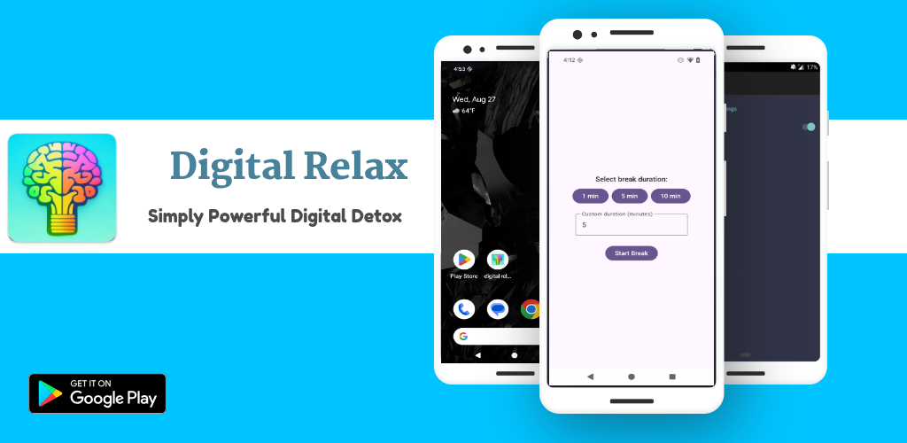
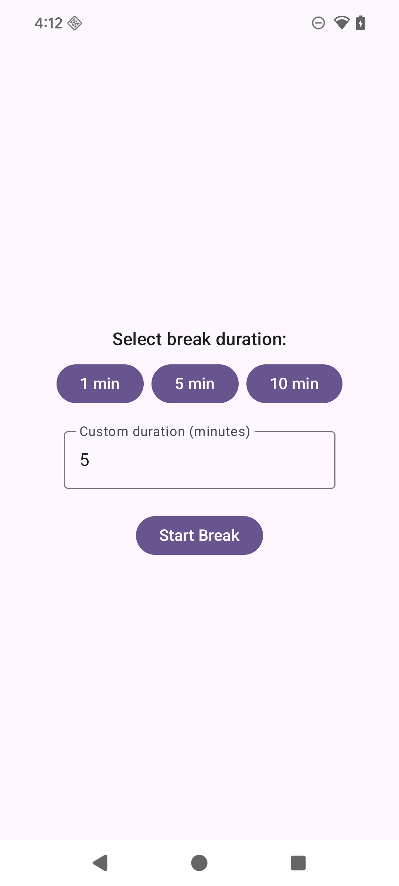
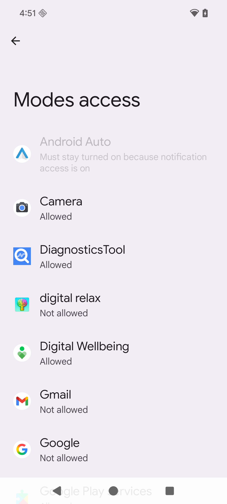

# Digital Relax 📱✨

> A mindful mobile application designed to help you take healthy digital breaks and improve your digital wellbeing.



## 🌟 Overview

Digital Relax is an Android application that encourages healthy digital habits by helping users take structured breaks from their devices. The app uses system-level controls to minimize distractions during break periods, promoting mindful technology use and mental wellness.

## ✨ Features

### 🎯 Core Functionality
- **Customizable Break Timers**: Choose from preset durations (1, 5, 10 minutes) or set custom break lengths
- **System-Level Focus Mode**: Automatically enables Do Not Disturb mode during breaks
- **Screen Lock Protection**: Prevents users from exiting the app during active breaks
- **Audio Notifications**: Plays completion sound when break period ends
- **Break Persistence**: Maintains break state even if app is restarted
- **Clean Material Design**: Modern UI built with Jetpack Compose and Material 3

### 🛡️ Digital Wellbeing Controls
- **Do Not Disturb Integration**: Silences notifications during break periods
- **Screen Stay-Awake**: Keeps screen active to display countdown timer
- **Task Lock Mode**: Pins the app to prevent switching to other applications
- **Permission Management**: Guides users through required permission setup

### 📱 User Interface
- **Intuitive Break Selection**: Easy-to-use buttons for common break durations
- **Live Countdown Display**: Real-time timer showing remaining break time
- **About Page**: Information about the app and its purpose
- **Responsive Design**: Optimized for various Android screen sizes

## 📸 Screenshots

| Home Screen | Break Timer | Permission Setup |
|-------------|-------------|------------------|
|  |  |  |

## 🚀 Installation

### From Source Code

1. **Clone the repository**:
   ```bash
   git clone https://github.com/suyash333/digital_relax.git
   cd digital_relax
   ```

2. **Open in Android Studio**:
   - Launch Android Studio
   - Select "Open an existing project"
   - Navigate to the cloned directory
   - Wait for Gradle sync to complete

3. **Build and Run**:
   - Connect an Android device or start an emulator
   - Click the "Run" button or press Shift+F10
   - Grant required permissions when prompted

### System Requirements

- **Android Version**: Android 10 (API 29) or higher
- **Target SDK**: Android 14 (API 36)
- **Architecture**: Universal (supports all Android architectures)
- **Storage**: Minimal storage required (~5MB)

## 🔧 Setup and Configuration

### Required Permissions

The app requires the following permissions for optimal functionality:

1. **Notification Policy Access** (`ACCESS_NOTIFICATION_POLICY`)
   - Purpose: Control Do Not Disturb settings during breaks
   - Setup: App will guide you through the permission grant process

### First-Time Setup

1. **Launch the app** and tap "Start Break"
2. **Grant permissions** when prompted:
   - Follow the system dialog to enable notification policy access
   - This allows the app to manage Do Not Disturb settings
3. **Test functionality** with a short break to ensure everything works

## 📖 Usage Guide

### Starting a Break

1. **Select Duration**:
   - Tap preset buttons (1 min, 5 min, 10 min) for quick selection
   - Or enter custom duration in the text field
   
2. **Begin Break**:
   - Tap "Start Break" button
   - The app will automatically:
     - Enable Do Not Disturb mode
     - Lock the screen to this app
     - Start the countdown timer

3. **During Break**:
   - View the live countdown on screen
   - Relax and take a mindful break from your device
   - The screen will stay on to show progress

4. **Break Completion**:
   - Hear the completion sound
   - See the "Hurray! You are successfully digitally relaxed" message
   - Normal phone functionality is automatically restored

### Managing Break Sessions

- **Interrupting Breaks**: The app prevents easy exit during breaks to encourage completion
- **App Restart**: If the app is closed during a break, it will restore the timer when reopened
- **System Persistence**: Break state is saved across app restarts and device reboots

## 🛠️ Technical Details

### Technology Stack

- **Platform**: Android (Kotlin)
- **UI Framework**: Jetpack Compose
- **Design System**: Material 3
- **Architecture**: Single Activity with Composable screens
- **Build System**: Gradle with Kotlin DSL
- **Minimum SDK**: 29 (Android 10)
- **Target SDK**: 36 (Android 14)

### Key Components

```kotlin
// Main application package
com.golearnsap.digitalrelax

// Core classes
├── MainActivity.kt           // Main activity and UI logic
├── ui.theme/
│   ├── Color.kt             // App color palette
│   ├── Theme.kt             // Material 3 theming
│   └── Type.kt              // Typography definitions
```

### Dependencies

- **AndroidX Core KTX**: Kotlin extensions for Android
- **Lifecycle Runtime KTX**: Lifecycle-aware components
- **Activity Compose**: Compose integration with activities
- **Compose BOM**: Bill of materials for Compose versions
- **Material 3**: Modern Material Design components
- **JUnit & Espresso**: Testing frameworks

### Development Features

- **Edge-to-Edge Display**: Modern full-screen experience
- **State Persistence**: Uses `rememberSaveable` for UI state
- **Sound Management**: SoundPool for efficient audio playback
- **Timer Management**: CountDownTimer for break functionality
- **Shared Preferences**: Persistent storage for app settings

## 🧪 Development Setup

### Prerequisites

- **Android Studio**: Arctic Fox (2020.3.1) or newer
- **JDK**: Java 11 or higher
- **Android SDK**: API level 29-36
- **Gradle**: 7.0 or higher

### Building the Project

1. **Sync Project**:
   ```bash
   ./gradlew sync
   ```

2. **Build Debug APK**:
   ```bash
   ./gradlew assembleDebug
   ```

3. **Run Tests**:
   ```bash
   ./gradlew test
   ./gradlew connectedAndroidTest
   ```

4. **Generate Release Build**:
   ```bash
   ./gradlew assembleRelease
   ```

### Code Style

The project follows standard Kotlin coding conventions:
- Use descriptive variable and function names
- Follow Material Design guidelines for UI components
- Implement proper error handling for system permissions
- Use Compose best practices for state management

## 🤝 Contributing

We welcome contributions to improve Digital Relax! Here's how you can help:

### Getting Started

1. **Fork the repository** on GitHub
2. **Create a feature branch**: `git checkout -b feature/amazing-feature`
3. **Make your changes** and test thoroughly
4. **Commit your changes**: `git commit -m 'Add amazing feature'`
5. **Push to the branch**: `git push origin feature/amazing-feature`
6. **Open a Pull Request** with a clear description

### Development Guidelines

- **Follow existing code style** and architecture patterns
- **Add tests** for new functionality when applicable
- **Update documentation** for any API or behavior changes
- **Test on multiple devices** and Android versions
- **Ensure accessibility** compliance for UI changes

### Areas for Contribution

- 🎨 **UI/UX Improvements**: Enhanced visual design and user experience
- 🔧 **Feature Additions**: New break types, statistics, or customization options
- 🐛 **Bug Fixes**: Resolve any issues or edge cases
- 📱 **Device Compatibility**: Testing and fixes for specific devices
- 🌐 **Internationalization**: Add support for multiple languages
- ♿ **Accessibility**: Improve support for users with disabilities

## 🎯 Future Enhancements

Planned features and improvements:

- [ ] **Break Statistics**: Track break history and patterns
- [ ] **Smart Notifications**: Intelligent break reminders based on usage
- [ ] **Custom Break Types**: Work breaks, meditation breaks, exercise breaks
- [ ] **Themes and Customization**: Dark mode, color themes, and personalization
- [ ] **Social Features**: Share achievements and challenge friends
- [ ] **Integration**: Connect with fitness apps and digital wellbeing platforms
- [ ] **Widgets**: Home screen widgets for quick break access
- [ ] **Wear OS Support**: Companion app for smartwatches

## 📄 License

This project is licensed under the MIT License - see the [LICENSE](LICENSE) file for details.

## 📞 Support

For questions, suggestions, or support:

- **Issues**: [GitHub Issues](https://github.com/suyash333/digital_relax/issues)
- **Discussions**: [GitHub Discussions](https://github.com/suyash333/digital_relax/discussions)
- **Email**: Contact the development team through GitHub

## 🙏 Acknowledgments

- **Material Design**: Google's Material Design system for UI components
- **Jetpack Compose**: Modern Android UI toolkit
- **Android Community**: For excellent documentation and examples
- **Digital Wellbeing Movement**: For inspiring mindful technology use

---

<div align="center">

**Made with ❤️ for digital wellness**

*Take a break, take care of yourself* 🌱

</div>